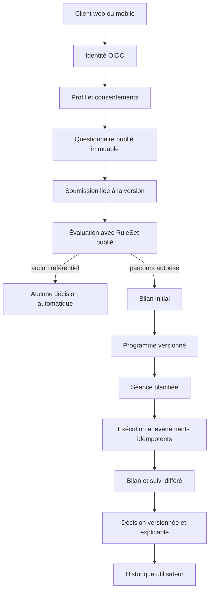

# Architecture du premier parcours

Statut : proposition à valider. Ce document ne contient aucune règle clinique, valeur ou seuil de décision.

## Parcours couvert

1. L'identité externe est rapprochée d'un utilisateur applicatif.
2. L'utilisateur complète son profil sportif et accepte les consentements requis.
3. Il récupère une version publiée du questionnaire de sécurité.
4. Il soumet des réponses liées exactement à cette version.
5. Le moteur évalue uniquement un jeu de règles publié et validé. En son absence, il ne prend aucune décision.
6. Si le parcours reste autorisé, un bilan initial est enregistré et une version de programme est attribuée.
7. L'utilisateur consulte sa semaine, démarre une séance et transmet des événements idempotents.
8. Une gêne peut interrompre la séance sans produire de diagnostic.
9. Le bilan, le point quotidien et le suivi différé deviennent les entrées d'une décision d'adaptation explicable.
10. L'historique restitue les faits, versions, décisions et justifications.

## Découpage des domaines

| Domaine        | Responsabilité                                                          | Ne doit pas faire                                        |
| -------------- | ----------------------------------------------------------------------- | -------------------------------------------------------- |
| Identity       | rapprocher `issuer/sub`, exposer l'utilisateur courant                  | stocker ou vérifier un mot de passe                      |
| Profiles       | profil sportif, préférences, fuseau et unités                           | conserver les réponses de santé dans le profil ordinaire |
| Consents       | définitions, versions, décisions et révocations                         | déduire un consentement de l'utilisation du service      |
| Questionnaires | rédaction, validation, publication et restitution de versions immuables | modifier une version publiée                             |
| Safety         | orchestrer l'évaluation et produire une orientation non diagnostique    | exécuter une règle non publiée                           |
| Assessments    | bilan initial et résultats fonctionnels versionnés                      | interpréter librement une donnée clinique                |
| Catalog        | exercices, médias, variantes et validation                              | servir un contenu désactivé ou non publié                |
| Programs       | programme, semaines, séances et justification                           | réécrire une version historique                          |
| Session runs   | cycle de vie d'une séance et événements idempotents                     | accepter un événement pour un autre propriétaire         |
| Tracking       | points quotidiens, bilans et suivis différés                            | affirmer une causalité ou un diagnostic                  |
| Adaptation     | simuler ou appliquer un jeu de règles publié                            | contenir des seuils codés dans l'application             |
| Administration | workflow clinique et désactivation urgente                              | modifier les données personnelles d'un utilisateur       |
| Audit          | trace minimale des opérations sensibles                                 | enregistrer les réponses ou commentaires complets        |
| Privacy        | export et suppression coordonnée                                        | exposer un export par identifiant seul                   |

## Dépendances autorisées

- Les modules HTTP appellent des cas d'usage, jamais PostgreSQL directement.
- Safety et Adaptation dépendent du port `PublishedRuleSetRepository` et non d'un format d'administration.
- Programs consomme une décision persistée ; il ne réévalue pas lui-même les règles.
- Audit reçoit des événements minimisés après succès ou échec de l'opération.
- Les notifications utilisent l'outbox et ne bloquent aucun accès sûr au programme.

## Invariants de sécurité

- Le `user_id` vient du jeton validé.
- Questionnaire, règles, exercice et programme référencent une version exacte.
- Toute création sensible possède une clé d'idempotence.
- Une décision conserve les identifiants de ses entrées et de la version du jeu de règles.
- Sans référentiel clinique publié, le résultat est `not_evaluated`; aucun programme n'est généré ou modifié automatiquement.
- Une gêne déclarée peut arrêter le flux, mais son libellé ne devient jamais un diagnostic.
